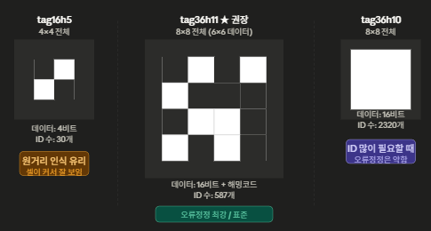
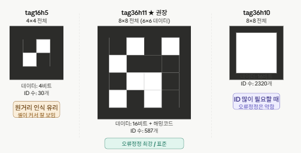

# Sim-to-Real-to-Sim & AprilTag 학습 노트
**날짜:** 2026-06-02  
**주제:** S2R2S 루프, Robot Learning, AprilTag 메커니즘

---

## 1. Sim-to-Real-to-Sim (S2R2S) 루프

### 고전 방식 vs S2R2S

| 구분 | 고전 방식 | S2R2S |
|------|-----------|-------|
| 방향 | 단방향 (Sim → Real) | 양방향 (Sim ⇄ Real) |
| 피드백 | 수동, 단발성 | 자동, 지속적 |
| 목표 | 문제 발생 시 복귀 | Real 데이터로 Sim 지속 교정 |

### 최대 장점: Domain Gap 자동 축소

| 단계 | 내용 |
|------|------|
| Sim → Real | 학습된 정책을 실로봇에 배포 |
| Real → Sim | 실로봇 센서 데이터·오차·거동 수집 |
| Sim 업데이트 | 수집 데이터로 물리 파라미터 자동 보정 (System ID) |
| 재학습 | 보정된 Sim에서 더 나은 정책 학습 |

루프가 돌수록 **Sim이 Real의 디지털 트윈에 수렴**한다.

### Sim 고도화로 좋아지는 것

1. **물리 피델리티 향상** → 정책 전이율 상승 (Zero-shot 가능)
2. **Edge Case 무한 재현** → Real에서 한 번 발생한 실패를 Sim에서 수천 번 반복
3. **센서 모델 정밀화** → LiDAR 노이즈, IMU 드리프트 특성을 Sim에 주입

### Real 환경 변화에 대한 Sim의 대응 한계

```
✅ 대응 가능
   - 느린 변화 (관절 마모, 환경 레이아웃 변경)
   - 예측 가능한 변화 (공장 라인 변경, 물체 추가)

❌ 대응 어려움
   - 갑작스러운 동적 장애물 (루프 주기 latency 문제)
   - 물리 법칙 밖의 변화 (하드웨어 손상, 재질 변성)
   - 완전히 새로운 환경 (Out-of-Distribution)
```

> **NVIDIA Isaac Sim + Cosmos 2.0의 방향:**  
> 단순 물리 파라미터 튜닝을 넘어, 비디오 기반 세계 모델(World Model)이  
> 환경 변화 자체를 예측·학습하는 패러다임으로 발전 중.

---

## 2. Robot Learning 분야 키워드 맵

### 큰 그림

```
Embodied AI / Robot Learning
│
├── 학습 패러다임
│   ├── Reinforcement Learning (RL)
│   ├── Imitation Learning (IL)
│   └── Self-Supervised Learning
│
├── Sim ↔ Real
│   ├── Sim-to-Real Transfer
│   ├── S2R2S / Digital Twin
│   └── Domain Randomization / Adaptation
│
├── 정책(Policy) 구조
│   ├── End-to-End Learning
│   ├── Foundation Model for Robotics
│   └── World Models
│
└── 응용
    ├── Legged Locomotion
    ├── Dexterous Manipulation
    └── Autonomous Navigation
```

### 핵심 RL 알고리즘

| 키워드 | 내용 |
|--------|------|
| PPO (Proximal Policy Optimization) | 로봇 locomotion 학습의 표준 알고리즘 |
| SAC (Soft Actor-Critic) | 연속 행동공간에서 샘플 효율 높음 |
| Model-Based RL | 환경 모델을 함께 학습해 샘플 수 절감 |
| Curriculum Learning | 쉬운 과제 → 어려운 과제 자동 난이도 조절 |

### Foundation Models for Robotics (최신 트렌드)

| 키워드 | 설명 | 대표 연구 |
|--------|------|-----------|
| VLA (Vision-Language-Action) | 카메라+언어 지시 → 행동 직접 출력 | RT-2, π0 |
| World Model | 미래 상태 예측 신경망 내부 시뮬레이터 | DreamerV3, Cosmos |
| Diffusion Policy | Diffusion 모델로 로봇 행동 생성 | Chi et al. 2023 |
| GR00T | NVIDIA 휴머노이드 Foundation Model | Isaac Lab 기반 |

### Legged Locomotion 전문 키워드

| 키워드 | 내용 |
|--------|------|
| Whole-Body Control (WBC) | 전신 동역학 통합 제어 |
| Proprioceptive Feedback | 외부 센서 없이 관절 센서만으로 걷기 |
| Parkour / Agile Locomotion | 장애물 극복, 점프 등 동적 운동 학습 |
| Loco-Manipulation | 이동하면서 동시에 물건 집기 |

### 주요 도구 생태계

| 도구 | 역할 |
|------|------|
| Isaac Lab | NVIDIA RL 학습 프레임워크 |
| MuJoCo | DeepMind 물리 엔진, 연구 표준 |
| Genesis | 2024년 신규, 초고속 물리 시뮬 |
| LeRobot | HuggingFace 로봇학습 오픈소스 |

---

## 3. 사람의 학습과 Robot Learning의 대응 구조

| 사람의 학습 | AI/로봇 학습 |
|------------|-------------|
| 처음엔 잘 안됨 | Random Policy 초기화 |
| 될 때까지 시행착오 | Reinforcement Learning |
| 머릿속에서 생각해봄 | World Model / Mental Simulation |
| 생각과 현실의 간격 파악 | Reality Gap / Domain Gap 측정 |
| 간격을 줄여감 | Sim-to-Real-to-Sim 루프 |

### 사람과 AI의 결정적 차이

```
사람:   시행착오 100번 → 자전거 습득
AI(RL): 시행착오 10,000,000번 필요 (Sample Inefficiency)
```

### 해결책들

| 방법 | 사람 학습과의 대응 |
|------|------------------|
| World Model | 머릿속에서 먼저 수백만 번 연습 |
| Imitation Learning | 전문가 시범 보고 시작 (유튜브 학습) |
| Curriculum Learning | 쉬운 것부터 순서대로 (교육과정) |
| Transfer Learning | 이미 배운 것을 다음 학습에 활용 |

### 진짜 효율적 학습이란

> **나쁜 효율:** 시간 대비 얼마나 많이 외웠는가  
> **좋은 효율:** 투자한 학습이 얼마나 오래, 넓게 전이되는가

학습에서 가장 중요한 것:
1. **실패를 데이터로 보는 관점** — 실패한 에피소드가 성공만큼 중요한 학습 신호
2. **내부 모델(World Model)의 정밀도** — "왜 그렇게 되는가"에 대한 인과 모델
3. **적절한 난이도 (Zone of Proximal Development)** — 너무 쉽거나 어려우면 성장 없음
4. **망각과 재학습 (Continual Learning)** — 적절한 망각이 일반화에 도움

---

## 4. 발표 프로젝트 분석 (충청 ICT이노베이션스퀘어)

### 프로젝트 핵심 구조

```
Isaac Sim (PhysX 5)
    ↓ Domain Randomization
ROS2 Bridge
    ↓ Image / LiDAR / IMU
TurtleBot3 + Jetson Orin Nano
    ↓ AprilTag 오차 측정
오차 프로필 (.yaml)
    ↓ 피드백
Isaac Sim 물리 파라미터 자동 업데이트
```

### 발표의 의미

1. **"우리는 지름길을 거부했다"**
   - Cosmos WFM → Custom USD 직접 제작으로 Pivot
   - 화려한 데모 대신 Reality Gap을 센티미터 단위로 측정하는 선택

2. **"S2R2S의 최소 단위를 증명했다"**
   - 측정(AprilTag) → 기록(.yaml) → 반영(Isaac Sim) 루프
   - NVIDIA, Boston Dynamics도 같은 구조를 더 크고 빠르게 돌릴 뿐

3. **"완성이 아닌 과정 자체가 학습이다"**

> **발표 클로징 한 문장:**  
> "Nav2가 아직 완전하지 않지만, 우리는 오차가 왜 생기는지는 압니다.  
> 그게 이 프로젝트의 실제 성과입니다."

---

## 5. AprilTag 메커니즘

### 동작 흐름

```
카메라 촬영
    ↓
① 이진화 (Threshold)
② 외곽선 추출
③ 사각형 후보 탐색
④ ID 비트 디코딩
⑤ 4개 꼭짓점 확정
    ↓
PnP (Perspective-n-Point) 풀이
    ↓
출력: Translation (x,y,z) + Rotation (roll,pitch,yaw)
```

### 핵심 원리: PnP 알고리즘

마커의 실제 크기(고정) + 이미지상 4 꼭짓점 픽셀 좌표  
→ 카메라와 마커 사이의 **6-DOF Pose**를 수학적으로 역산

딥러닝 없음. 순수 카메라 기하학 + 행렬 연산.

### 내부 구조 (3겹)

| 영역 | 역할 |
|------|------|
| 외곽 검정 테두리 | 마커 감지 + 4 꼭짓점 확정 |
| 흰색 여백 (Quiet Zone) | 배경과 마커 경계 분리 |
| 데이터 비트 (격자) | 마커 고유 ID 저장 (검정=1, 흰색=0) |

> **내부 패턴 = 마커의 ID(숫자)를 이진 코드로 새긴 것**  
> QR코드가 URL을 저장하듯, AprilTag는 정수 ID 하나만 저장.  
> 위치 계산은 패턴이 아닌 테두리의 4 꼭짓점 기하학으로 수행.

### AprilTag 패밀리 비교

| 패밀리 | 비트 | ID 수 | 특징 |
|--------|------|-------|------|
| tag16h5 | 4×4 | 30개 | 원거리 인식 유리 |
| tag36h11 | 6×6 | 587개 | 오류 정정 강함 **(권장)** |
| tagStandard41h12 | — | 2115개 | 최신 표준 |

> `isaac_ros_apriltag` 기본값 = **tag36h11**

### 해밍코드 오류 정정

16비트 전부를 ID에 쓰지 않고 일부를 오류 정정에 할당  
→ 마커가 일부 가려지거나 훼손돼도 ID 복원 가능

---

## 6. 카메라 각도와 인식 정확도

| 방식 | 정밀도 | 비고 |
|------|--------|------|
| TOP view (수직) | ±2~3mm @ 1m | 이상적, 원근 왜곡 없음 |
| 측면 경사 view | ±1~3cm @ 1m | 각도 클수록 z축 오차 급증 |

**권장 인식 각도:** 수직(90°) 기준 ±45° 이내

### 배치 전략 (소형 공간 120×155cm 기준)

```
┌─────────────────────┐
│  [ID:0]      [ID:1] │  ← 코너 4개: 공간 좌표계 정렬용
│                     │
│       [ID:4]        │  ← 중앙: 주행 오차 측정용
│                     │
│  [ID:2]      [ID:3] │
└─────────────────────┘
```

- **코너 4개:** Sim ↔ Real 원점 정렬
- **중앙 1개:** Odometry 슬립 오차 측정

---

## 7. AprilTag 이미지 생성 Python 코드

### 의존성 설치

```bash
pip install opencv-contrib-python numpy
```

### 핵심 코드

```python
import cv2
import numpy as np

# 패밀리 선택
aruco_dict = cv2.aruco.getPredefinedDictionary(
    cv2.aruco.DICT_APRILTAG_36H11
)

# 마커 생성 (ID, 픽셀 크기)
marker_img = cv2.aruco.generateImageMarker(aruco_dict, tag_id=0, sidePixels=400)

# 흰색 여백 추가 (인쇄 필수)
margin = 60
canvas = np.ones((400 + margin*2, 400 + margin*2), dtype=np.uint8) * 255
canvas[margin:margin+400, margin:margin+400] = marker_img

cv2.imwrite("tag36h11_id000.png", canvas)
```

```
"""
AprilTag 이미지 생성기
=====================
의존성: opencv-contrib-python, numpy
설치:   pip install opencv-contrib-python numpy

사용법:
    python generate_apriltags.py                   # 기본 (tag36h11, ID 0~4)
    python generate_apriltags.py --family tag16h5  # 패밀리 변경
    python generate_apriltags.py --ids 0 1 2 3     # ID 지정
    python generate_apriltags.py --ids 0 9 --size 600 --grid  # 크기 + 그리드
    python generate_apriltags.py --all-families    # 모든 패밀리 생성
"""

import cv2
import numpy as np
import os
import argparse


# ── 지원 패밀리 ──────────────────────────────────────────────────────────────
FAMILIES = {
    "tag16h5":  cv2.aruco.DICT_APRILTAG_16H5,   # 30개  ID, 4x4 비트, 원거리 인식 유리
    "tag25h9":  cv2.aruco.DICT_APRILTAG_25H9,   # 35개  ID, 5x5 비트
    "tag36h10": cv2.aruco.DICT_APRILTAG_36H10,  # 2320개 ID, 6x6 비트
    "tag36h11": cv2.aruco.DICT_APRILTAG_36H11,  # 587개 ID, 6x6 비트, 오류정정 강함 (권장)
}

# isaac_ros_apriltag 기본값 = tag36h11
DEFAULT_FAMILY = "tag36h11"
DEFAULT_IDS    = [0, 1, 2, 3, 4]
DEFAULT_SIZE   = 400   # 마커 픽셀 크기
DEFAULT_MARGIN = 60    # 흰색 여백 (인쇄 시 필수)


def generate_marker(aruco_dict, tag_id: int, size: int, margin: int,
                    family_name: str) -> np.ndarray:
    """마커 1개를 생성하고 여백 + 라벨을 추가한 이미지를 반환."""
    marker = cv2.aruco.generateImageMarker(aruco_dict, tag_id, size)

    canvas_size = size + margin * 2
    canvas = np.ones((canvas_size, canvas_size), dtype=np.uint8) * 255
    canvas[margin:margin + size, margin:margin + size] = marker

    label = f"{family_name}  ID: {tag_id}"
    font_scale = max(0.4, size / 700)
    cv2.putText(canvas, label,
                (margin, canvas_size - 16),
                cv2.FONT_HERSHEY_SIMPLEX,
                font_scale, 0, 1, cv2.LINE_AA)

    return canvas


def make_grid(images: list, cols: int = 5) -> np.ndarray:
    """마커 이미지 리스트를 그리드 한 장으로 합침."""
    rows = (len(images) + cols - 1) // cols
    h, w = images[0].shape[:2]
    grid = np.ones((h * rows, w * cols), dtype=np.uint8) * 255
    for idx, img in enumerate(images):
        r, c = divmod(idx, cols)
        grid[r * h:(r + 1) * h, c * w:(c + 1) * w] = img
    return grid


def run(family_name: str, ids: list, size: int, margin: int,
        output_dir: str, save_grid: bool, grid_cols: int):

    if family_name not in FAMILIES:
        raise ValueError(f"지원하지 않는 패밀리: {family_name}\n"
                         f"선택 가능: {list(FAMILIES.keys())}")

    aruco_dict = cv2.aruco.getPredefinedDictionary(FAMILIES[family_name])
    save_dir = os.path.join(output_dir, family_name)
    os.makedirs(save_dir, exist_ok=True)

    images = []
    for tag_id in ids:
        img = generate_marker(aruco_dict, tag_id, size, margin, family_name)
        path = os.path.join(save_dir, f"{family_name}_id{tag_id:03d}.png")
        cv2.imwrite(path, img)
        images.append(img)
        print(f"  저장: {path}")

    if save_grid and len(images) > 1:
        grid = make_grid(images, cols=min(grid_cols, len(images)))
        grid_path = os.path.join(
            output_dir,
            f"{family_name}_grid_id{ids[0]}-{ids[-1]}.png"
        )
        cv2.imwrite(grid_path, grid)
        print(f"  그리드: {grid_path}")

    print(f"  완료: {len(images)}개 마커 생성\n")


def main():
    parser = argparse.ArgumentParser(description="AprilTag 이미지 생성기")
    parser.add_argument("--family",  default=DEFAULT_FAMILY,
                        choices=list(FAMILIES.keys()),
                        help=f"AprilTag 패밀리 (기본: {DEFAULT_FAMILY})")
    parser.add_argument("--ids",     nargs="+", type=int,
                        default=DEFAULT_IDS,
                        help="생성할 ID 목록 (기본: 0 1 2 3 4)")
    parser.add_argument("--size",    type=int, default=DEFAULT_SIZE,
                        help=f"마커 픽셀 크기 (기본: {DEFAULT_SIZE})")
    parser.add_argument("--margin",  type=int, default=DEFAULT_MARGIN,
                        help=f"흰색 여백 px (기본: {DEFAULT_MARGIN})")
    parser.add_argument("--output",  default="apriltags",
                        help="출력 디렉토리 (기본: apriltags/)")
    parser.add_argument("--grid",    action="store_true",
                        help="그리드 이미지도 생성")
    parser.add_argument("--grid-cols", type=int, default=5,
                        help="그리드 열 수 (기본: 5)")
    parser.add_argument("--all-families", action="store_true",
                        help="모든 패밀리 동시 생성")
    args = parser.parse_args()

    print("=" * 50)
    print("  AprilTag 이미지 생성기")
    print("=" * 50)

    if args.all_families:
        for fam in FAMILIES:
            print(f"\n[{fam}]")
            run(fam, args.ids, args.size, args.margin,
                args.output, args.grid, args.grid_cols)
    else:
        print(f"\n[{args.family}]  ID: {args.ids}")
        run(args.family, args.ids, args.size, args.margin,
            args.output, args.grid, args.grid_cols)


if __name__ == "__main__":
    main()

```


### 사용법 (generate_apriltags.py)

```bash
# 기본 실행 (tag36h11, ID 0~4)
python generate_apriltags.py

# ID 지정 + 그리드 이미지 생성
python generate_apriltags.py --ids 0 1 2 3 4 --grid

# 인쇄용 고해상도
python generate_apriltags.py --ids 0 1 2 3 4 --size 800 --grid

# 모든 패밀리 한 번에 생성
python generate_apriltags.py --all-families --grid
```


---

## 8. AprilTag 격자 크기 / 마커 크기 / 가려짐 문제

### 8-1. 격자 크기: 6×6 이상·이하도 가능한가

**가능하다.** 패밀리마다 격자 크기가 다르다.

| 패밀리 | 전체 격자 | 데이터 비트 | ID 수 | 특징 |
|--------|-----------|-------------|-------|------|
| tag16h5 | 4×4 | 2×2 = 4bit | 30개 | 셀이 커서 원거리 인식 유리 |
| tag25h9 | 5×5 | 3×3 = 9bit | 35개 | 중간 |
| **tag36h11** | **8×8** | **4×4 = 16bit** | **587개** | **오류정정 최강 ★ 권장** |
| tag36h10 | 8×8 | 4×4 = 16bit | 2320개 | ID 많이 필요할 때, 오류정정 약함 |

**선택 기준:**
- 격자 **작을수록** → 셀이 커져 멀리서 잘 보임
- 격자 **클수록** → ID 수 증가, 오류 정정 강화
- 마커 수가 5~10개 수준이면 `tag36h11`이 압도적으로 유리





---

### 8-2. 거리에 따른 마커 크기 조절

**매우 의미 있다.** 거리에 따른 적정 마커 크기 공식:

```
최소 마커 크기 (cm) = 측정 거리 (cm) × 0.1
```

| 측정 거리 | 최소 마커 크기 | 권장 크기 |
|-----------|---------------|-----------|
| 50cm | 5cm | 10cm |
| 1m | 10cm | 15~20cm |
| 2m | 20cm | 30cm |
| 3m 이상 | 30cm+ | 40cm 이상 |

> **핵심 조건:** 카메라 이미지에서 마커가 **최소 10×10 픽셀 이상** 찍혀야 비트 인식 안정.  
> 이 프로젝트 (120×155cm 공간, 1m 이내 측정) → **15cm 인쇄 마커** 권장

---

### 8-3. 마커가 가려지는 문제

```
가려짐 정도           결과
──────────────────────────────────────────
25% 이하 가려짐  →  해밍코드가 복원, 정상 인식
25~50% 가려짐   →  ID는 읽히지만 위치 정밀도 저하
50% 이상 가려짐  →  인식 실패
```

**이 프로젝트에서 가려짐이 발생하는 경우:**

1. **로봇이 마커를 밟고 지나갈 때** → 완전 가려짐 = 인식 불가
2. **조명 그림자 / 먼지** → 해밍코드가 어느 정도 커버

**실용적 대응 전략:**

```
바닥 배치 시:
  → 주행 경로 중앙이 아닌 옆쪽에 배치
  → 로봇이 마커 옆을 지나치며 인식 (밟히는 상황 설계에서 회피)

천장 배치 시:
  → 가려짐 문제 없음
  → 로봇 위에 상향 카메라 필요 (무게·전력 트레이드오프)
```

> **이 프로젝트 권장 방식:**  
> "로봇이 마커 위를 통과하기 직전 프레임"을 유효 데이터로 사용.  
> `isaac_ros_apriltag`는 연속 프레임에서 마커가 사라지는 타이밍도 로그로 남기므로,  
> 가려지는 순간 자체를 **로봇이 해당 위치를 통과했다는 트리거 신호**로 활용 가능.


---

## 참고 자료

- [NVIDIA Isaac Sim Documentation](https://docs.omniverse.nvidia.com/isaacsim/)
- [isaac_ros_apriltag GitHub](https://github.com/NVIDIA-ISAAC-ROS/isaac_ros_apriltag)
- [AprilTag 공식 사이트](https://april.eecs.umich.edu/software/apriltag)
- [Isaac Sim Korea Cafe](https://cafe.naver.com/isaacsimkr)
- [ROS2 TurtleBot3 URDF Import](https://nvidia-isaac-ros.github.io/)

---

# ROS2 TurtleBot3 1m 이동 명령 방법

**환경**: ROS2 + Jetson Orin Nano + TurtleBot3 (IMU·LiDAR·엔코더 장착)

---

## 개요

TurtleBot3에 "정확히 1m 직진"을 명령하는 방법은 크게 3가지.  
정밀도와 구현 복잡도에 따라 선택한다.

---

## ① 오픈루프 속도 명령 (Open-Loop Velocity Command)

**원리**: `/cmd_vel`에 일정 속도를 publish 하고, 계산된 시간 후 stop.

```bash
# 0.2 m/s로 5초간 publish → 1m 이동
ros2 topic pub --rate 10 /cmd_vel geometry_msgs/Twist \
  "{linear: {x: 0.2, y: 0.0, z: 0.0}, angular: {x: 0.0, y: 0.0, z: 0.0}}" &
sleep 5
ros2 topic pub --once /cmd_vel geometry_msgs/Twist \
  "{linear: {x: 0.0, y: 0.0, z: 0.0}, angular: {x: 0.0, y: 0.0, z: 0.0}}"
```

| 항목 | 내용 |
|---|---|
| 메시지 타입 | `geometry_msgs/Twist` |
| 토픽 | `/cmd_vel` |
| 정밀도 | 낮음 (바퀴 슬립·배터리·지면 영향) |
| 장점 | 가장 단순, 별도 패키지 불필요 |
| 단점 | 실제 거리 부정확, 외란 보상 불가 |

---

## ② Odometry 피드백 기반 폐루프 제어 (Closed-Loop Odometry) ✅ **추천**

**원리**: `/odom` (`nav_msgs/Odometry`)을 실시간 구독하여 이동 거리를 추적하고,  
목표(1m) 도달 시 정지.

### Python 노드 예시

```python
import rclpy
from rclpy.node import Node
from geometry_msgs.msg import Twist
from nav_msgs.msg import Odometry

class Move1m(Node):
    def __init__(self):
        super().__init__('move_1m')
        self.cmd_pub = self.create_publisher(Twist, '/cmd_vel', 10)
        self.odom_sub = self.create_subscription(Odometry, '/odom', self.odom_cb, 10)
        self.start_x = None
        self.target_distance = 1.0
        self.moving = True

    def odom_cb(self, msg):
        if self.start_x is None:
            self.start_x = msg.pose.pose.position.x
            self.get_logger().info(f'Start position: {self.start_x}')

        current_x = msg.pose.pose.position.x
        distance = abs(current_x - self.start_x)
        self.get_logger().info(f'Moved: {distance:.3f}m / {self.target_distance}m')

        if distance >= self.target_distance:
            twist = Twist()          # zero Twist = stop
            self.cmd_pub.publish(twist)
            self.moving = False
            self.get_logger().info('Reached 1m!')
            rclpy.shutdown()
        elif self.moving:
            twist = Twist()
            twist.linear.x = 0.22   # TurtleBot3 Burger max: 0.22 m/s
            self.cmd_pub.publish(twist)

def main():
    rclpy.init()
    node = Move1m()
    rclpy.spin(node)

if __name__ == '__main__':
    main()
```

### 실행 방법

```bash
# TurtleBot3 bringup (실제 로봇)
ros2 launch turtlebot3_bringup robot.launch.py

# 또는 Gazebo 시뮬레이션
export TURTLEBOT3_MODEL=burger
ros2 launch turtlebot3_gazebo empty_world.launch.py

# 이동 노드 실행
ros2 run your_package move_1m
```

| 항목 | 내용 |
|---|---|
| 사용 토픽 | publish: `/cmd_vel`, subscribe: `/odom` |
| 정밀도 | 중간 (엔코더 기반, 슬립 시 오차 발생) |
| 장점 | 외란에 강건, 구현 간단 |
| 단점 | 바퀴 슬립 누적 시 오차 |

---

## ③ Nav2 액션 기반 목표 전송 (Nav2 Action Goal)

**원리**: Nav2 스택의 `navigate_to_pose` 액션 서버에 목표 좌표를 전송.  
지도 기반 localization + 장애물 회피 포함.

### CLI로 직접 전송

```bash
# 프로토타입 확인
ros2 interface proto nav2_msgs/action/NavigateToPose

# 1m 앞(map坐标系 기준 (0,0) → (1,0))
ros2 action send_goal /navigate_to_pose nav2_msgs/action/NavigateToPose \
  "{pose: {header: {frame_id: 'map'}, pose: {position: {x: 1.0, y: 0.0, z: 0.0}, orientation: {w: 1.0}}}}" -f
```

### Python 액션 클라이언트

```python
import rclpy
from rclpy.action import ActionClient
from rclpy.node import Node
from nav2_msgs.action import NavigateToPose
from geometry_msgs.msg import PoseStamped

class Nav2GoalClient(Node):
    def __init__(self):
        super().__init__('nav2_goal_client')
        self.client = ActionClient(self, NavigateToPose, '/navigate_to_pose')

    def send_goal(self, x, y, yaw=0.0):
        goal_msg = NavigateToPose.Goal()
        goal_msg.pose = PoseStamped()
        goal_msg.pose.header.frame_id = 'map'
        goal_msg.pose.header.stamp = self.get_clock().now().to_msg()
        goal_msg.pose.pose.position.x = x
        goal_msg.pose.pose.position.y = y
        goal_msg.pose.pose.orientation.w = 1.0
        # yaw → quaternion 변환은 tf_transformations 사용 권장

        self.client.wait_for_server()
        future = self.client.send_goal_async(goal_msg)
        rclpy.spin_until_future_complete(self, future)
        return future.result()
```

### Nav2 실행

```bash
# 지도 기반 Nav2 실행
ros2 launch turtlebot3_navigation2 navigation2.launch.py \
  map:=/path/to/map.yaml use_sim_time:=False

# Rviz2에서 초기 위치 설정 후 액션 전송
```

| 항목 | 내용 |
|---|---|
| 액션 | `nav2_msgs/action/NavigateToPose` |
| 정밀도 | 높음 (지도·LiDAR·IMU 융합) |
| 장점 | 장애물 회피, recovery 행동 자동 |
| 단점 | 지도 필요, Nav2 설정 복잡 |

---

## Jetson Orin Nano + IMU 활용 팁

### robot_localization EKF로 센서 융합

```bash
# IMU + Wheel Odometry 융합 노드
ros2 run robot_localization ekf_node \
  --ros-args -p frequency:=30 \
  -p two_d_mode:=true \
  -p publish_tf:=true \
  -p odom0:=/odom \
  -p imu0:=/imu
```

| 구성 요소 | 역할 |
|---|---|
| **Jetson Orin Nano** | ROS2 노드 실행, EKF·센서 퓨전, GPU 가속 가능 |
| **IMU** | robot_localization EKF로 odometry 개선 → 슬립·요철 보상 |
| **LiDAR** | Nav2 localization (AMCL), 장애물 회피 |
| **Wheel Encoder** | 기초 odometry 제공 (저주파 drift 존재) |

---

## 접근법 비교 요약

| 방법 | 정밀도 | 구현 난이도 | 외란 강건 | 장애물 회피 | 추천 상황 |
|---|---|---|---|---|---|
| ① 오픈루프 `cmd_vel` | 낮음 (20~50% 오차) | ⭐ | ❌ | ❌ | 즉각 테스트 |
| ② Odometry 폐루프 | 중간 (1~5% 오차) | ⭐⭐ | ✅ | ❌ | **일반적 정밀 이동** |
| ② + IMU EKF 융합 | 높음 (<1% 오차) | ⭐⭐⭐ | ✅✅ | ❌ | 정밀 이동 필요 시 |
| ③ Nav2 액션 골 | 높음 | ⭐⭐⭐⭐ | ✅✅ | ✅ | 자율주행·내비게이션 |

---

## Odometry 상세 해설

### Odometry란?

**Odometry** (주행거리 측정법) — 그리스어 *hodos*(길) + *metron*(측정)에서 유래.

로봇이 **자체 운동 데이터**(바퀴 회전, 관성 센서)만으로 **현재 위치를 추정**하는 방법.  
외부 비전 마커나 GPS 없이도 "출발점 대비 얼마나 움직였는가"를 계산한다.

---

### ②번 방법의 거리 측정 체인

#### 핵심 센서: Wheel Encoder (바퀴 엔코더)

TurtleBot3의 DYNAMIXEL XL430-W250 서보 모터에는 **자기식(Magnetic) 엔코더**가 내장되어 있음.

**측정 체인:**

```
바퀴 회전각(θ)  →  바퀴가 굴러간 거리(d)  →  로봇의 이동 거리(x)
```

| 단계 | 계산 | 설명 |
|---|---|---|
| ① 엔코더가 회전각 측정 | Δθ_L, Δθ_R | 좌·우 바퀴 각각의 회전각 (rad) |
| ② 바퀴 접촉점 이동 거리 | d_L = r × Δθ_L, d_R = r × Δθ_R | r = 바퀴 반지름 |
| ③ 로봇 병진 이동 거리 | Δd = (d_L + d_R) / 2 | 좌우 평균 = 로봇 중심 이동 |
| ④ 회전 각도 | Δφ = (d_R - d_L) / W | W = 좌우 바퀴 사이 거리 (track width) |

→ 이 결과가 `nav_msgs/Odometry` 메시지의 `pose.pose.position.x`에 누적되어 publish 됨.

---

### 수학적 근거: Unicycle Model

차동 구동 로봇의 표준 운동 모델:

```
x(t) = ∫ v(t)·cos(φ(t)) dt
y(t) = ∫ v(t)·sin(φ(t)) dt
φ(t) = ∫ ω(t) dt
```

여기서:
- **v(t)** = (v_R + v_L) / 2 — 로봇 선속도
- **ω(t)** = (v_R - v_L) / W — 로봇 각속도
- **v_R = r × ω_R**, **v_L = r × ω_L** — 각 바퀴의 접선 속도
- **r** — 바퀴 반지름
- **W** — 좌우 바퀴 사이 거리 (tread width)

TurtleBot3의 `/odom` 토픽은 이 모델에 따라 **엔코더 틱 → 바퀴 회전각 → 로봇 변위**를  
실시간으로 계산하여 publish 한다. (`turtlebot3_node` 또는 `diff_drive_controller`가 담당)

---

### 정확도 분석

#### 조건별 오차

| 조건 | 오차 범위 | 원인 |
|---|---|---|
| 엔코더만 사용 (open-loop odometry) | **1~5%** | 바퀴 슬립, 공기압, 지면 요철, 바퀴 반지름 오차 |
| IMU 융합 (EKF) | **< 1%** | 자이로가 회전 drift 보정, 가속도계가 슬립 감지 |
| 장거리 누적 (10m+, 엔코더 단독) | **5~20%** | 오차가 시간에 따라 누적되는 drift 현상 |
| 장거리 + IMU EKF | **2~5%** | drift는 완화되나 완전 제거 불가 |

#### 오차 요인 상세

| 요인 | 영향 | 설명 |
|---|---|---|
| **바퀴 슬립** | 가장 큼 | 가속/감속·장애물 충돌 시 엔코더는 회전했지만 실제 진행 거리는 짧음 |
| **바퀴 반지름 오차** | 비례 오차 | 타이어 마모·공기압 변화로 r이 실제와 다름 |
| **표면 요철** | 무작위 오차 | 카펫·경사면·턱에서 바퀴 유효 반지름 변화 |
| **양자화 오차** | 미미 | 엔코더 분해능 자체는 높음 (XL430: 0.088°/step ≈ 4,096 CPR) |
| **회전 누적** | 2차 오차 | 회전 각도 오차가 직진 위치 오차로 증폭 (trigonometric amplification) |

#### 실제 TurtleBot3 계측 사례 (1m 이동 기준)

| 조건 | 평균 오차 |
|---|---|
| 평탄한 마루, 저속 (0.1 m/s) | ±1~2 cm (1~2%) |
| 카펫, 저속 | ±3~5 cm (3~5%) |
| 평탄, 고속 (0.2 m/s, 급가속) | ±4~8 cm (4~8%) |
| IMU EKF 융합, 평탄 | ±0.5~1 cm (<1%) |

#### 결론

②번 방법의 **핵심 센서는 Wheel Encoder**이며, 바퀴 회전각 × 반지름 = 이동 거리라는  
기하학적 원리(Unicycle model)에 기반한다.

**단독 정확도는 ~1~5%** 로 짧은 거리(1m)에서는 실용적이지만,  
**IMU를 EKF로 융합하면 <1%** 까지 개선되며,  
그래도 장기적으로는 drift가 누적되므로 **LiDAR + AMCL이나 GPS** 같은 절대 위치 센서로 주기적 보정이 필요하다.

---

## 참고

- TurtleBot3 ROS2 공식 문서: [ROBOTIS e-Manual](https://emanual.robotis.com/docs/en/platform/turtlebot3/quick-start/)
- Nav2 공식 문서: [docs.nav2.org](https://docs.nav2.org/)
- robot_localization: [ros2/robot_localization](https://github.com/cra-ros-pkg/robot_localization)

---

*생성일: 2026-06-02 | Claude Sonnet 4.6*

